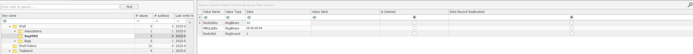
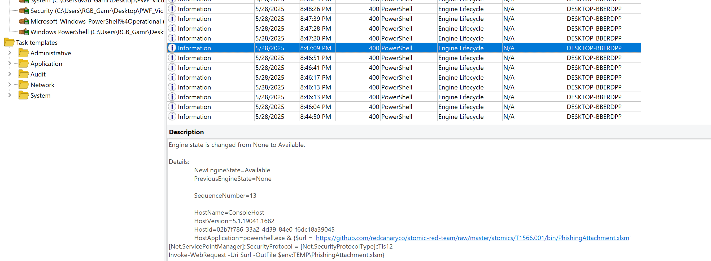

# Atomic Red Team Attack Script

Project Brief: This project is to set up a win 10 virtual machine as a target, attack it using the atomic red team attack script. Simulate that we are a Forensic Analyst just arriving to the site and proceed with a full Windows Forensics case as we would on field. Finishing with a deacted forensic report at the end.

Below are the attacks that this script has executed:


Tools used:
- EZTools
- Volitility
- KAPE
- Autopsy
- RegRipper
- Arsenal Image Mounter

## Collection


**Order of collection should always follow the order of volitility**
- **Step 1**: In real life we will either take a live Data from the machine or put the machine into hibernation so we can collect the data from the memory through hiber.sys file on windows. All this should be done
with a write blocker. In the VM now, we will suspend the VM first. Since I am using VMware, I will preserve the .vmem and the .vmsn and hash it. Next we will collect the disk by using qemu-img by running 
`qemu-img.exe convert -O vpc <full path that contains vmdk> output_image.vhd`. Hashes will be generated after all this. In real life, all this should be done with FTK Imager instead. 


Examiner notes: So after running the script, never has been touched, I suspended the machine immediately to prevent it's state. After that, I took a snapshot. I then preserved the .vmem and .vmsn file to a new location as well as using qemu-img to preserve the disk by exporting as vhd. After that, the first thing and most important thing to do is to generate and compare hash values. 


List of artifacts to collect and examine

Disk Analysis Process: 
- System & Usesr Info
   - Registry
- File Analysis
   - NTFS
- Evidence of Execution
   - Background Activity Moderator
   - ShimCache
   - Amcache
   - Prefetch
- Persistence Mechanisms
   - Run Keys
   - Startup Folder
   - Scheduled Tasks
   - Services
- Event Log Analysis

Examiner notes: Before any deep investigating, I mounted the disk using Arsenal image mounter, it was put on read mode only. However, it would be a better practice to have a hardware write blocker in real life, to prevent any accidental tempering of the disk.


Examiner notes: After browsing around and familiarise with the disk (users and files on the disk etc). I used KAPE (KAPE TRIAGE selection) to extract the most common and important evidence. Registries, Event logs, startup Folders etc.


## System Information

Examiner notes: For all the basic info of the system, I used either the registry explorer from Eric Zimmerman or Reg Ripper to obtain the information


Computername: 
Registry: HKLM\System\CurrentControlSet\Control\Computername\

`DESKTOP-BBERDPP`

Windows Version: 
Registry: HKLM\Software\Microsoft\Windows NT\Currentversion\


```
ProductName               Windows 10 Enterprise Evaluation
ReleaseID                 2009
BuildLab                  19041.vb_release.191206-1406
BuildLabEx                19041.1.amd64fre.vb_release.191206-1406
CompositionEditionID      EnterpriseEval
RegisteredOrganization
RegisteredOwner           PWF_Victim
UBR                       2006
InstallDate               2025-05-28 19:20:00Z
InstallTime               2025-05-28 19:20:00Z
UBR                       2006
```

Timezone:
Registry: HKLM\System\CurrentControlSet\Control\TimeZoneInformation\

```
TimeZoneInformation key
ControlSet001\Control\TimeZoneInformation
LastWrite Time 2025-05-29 04:17:17Z
  DaylightName   -> @tzres.dll,-211
  StandardName   -> @tzres.dll,-212
  Bias           -> 480 (8 hours)
  ActiveTimeBias -> 420 (7 hours)
  TimeZoneKeyName-> Pacific Standard Time

Network Information: 
Registry: HKLM\System\CurrentControlSet\Services\Tcpip\Parameters\Interfaces\{interface-name}
```

```
Adapter: {3b4cb90d-57a4-4414-8c13-e6ca6904c4d8}
LastWrite Time: 2025-05-28 19:27:50Z
  EnableDHCP                   1
  Domain
  NameServer
  DhcpIPAddress                192.168.65.150
  DhcpSubnetMask               255.255.255.0
  DhcpServer                   192.168.65.254
  Lease                        1800
  LeaseObtainedTime            2025-05-28 19:27:50Z
  T1                           2025-05-28 19:42:50Z
  T2                           2025-05-28 19:54:05Z
  LeaseTerminatesTime          2025-05-28 19:57:50Z
  AddressType                  0
  IsServerNapAware             0
  DhcpConnForceBroadcastFlag   0
  DhcpDomain                   localdomain
  DhcpNameServer               192.168.65.2
  DhcpDefaultGateway           192.168.65.2
  DhcpSubnetMaskOpt            255.255.255.0
```

```
Microsoft\Windows NT\CurrentVersion\NetworkList\Profiles
Network
  Key LastWrite    : 2025-05-28 19:33:52Z
  DateLastConnected: 2025-05-28 12:33:52
  DateCreated      : 2025-05-28 20:19:54
  DefaultGatewayMac: 00-50-56-FB-B6-EB
  Type             : wired
```

Shutdown time: 
Registry: HKLM\System\ControlSet001\Control\Windows\ShutdownTime
```
ControlSet001\Control\Windows key, ShutdownTime value
LastWrite time: 2025-05-28 19:42:04Z
ShutdownTime  : 2025-05-28 19:42:04Z
```

Defender settings:
Registry: HKLM\Software\Microsoft\Windows Defender\
Regripper command: `rip.pl -r C:\Users\RGB_Gamr\Desktop\PWF_Victim\Common Registry\SOFTWARE -p defender`

```
defender v.20200427
(Software) Get Windows Defender settings
Key path: Microsoft\Windows Defender
LastWrite Time 2025-05-28 19:27:26Z
Key path: Microsoft\Windows Defender\Exclusions\Paths
Key path: Microsoft\Windows Defender\Exclusions\Extensions
Key path: Microsoft\Windows Defender\Exclusions\Processes
Key path: Microsoft\Windows Defender\Exclusions\TemporaryPaths
Key path: Microsoft\Windows Defender\Exclusions\IpAddresses
Key path: Microsoft\Windows Defender\Features
TamperProtection value = 1
If TamperProtection value = 1, it's disabled
Key path: Microsoft\Windows Defender\Spynet
LastWrite Time: 2025-05-28 19:41:34Z
Spynet\SpynetReporting value = 2
Spynet\SubmitSamplesConsent value = 1
Key path: Microsoft\Windows Defender\Real-Time Protection
LastWrite Time: 2025-05-29 03:17:40Z
Key path: Policies\Microsoft\Windows Defender
LastWrite Time 2025-05-28 19:41:33Z
Key path: Policies\Microsoft\Windows Defender\Exclusions\Paths
Key path: Policies\Microsoft\Windows Defender\Exclusions\Extensions
Key path: Policies\Microsoft\Windows Defender\Exclusions\Processes
Key path: Policies\Microsoft\Windows Defender\Exclusions\TemporaryPaths
Key path: Policies\Microsoft\Windows Defender\Exclusions\IpAddresses
DisableAntiSpyware value = 1
Key path: Policies\Microsoft\Windows Defender\Real-Time Protection
LastWrite Time: 2025-05-28 19:41:33Z
DisableRealtimeMonitoring value = 1
```

## Users, Groups, User Profiles


| User ID | User Name         | Created On           | Last Login Time       | Last Password Change  | Total Login Count | Groups                   | Comment                                                              | Account Disabled | Password Not Required | Normal User Account | Password Does Not Expire |
|---------|-------------------|----------------------|------------------------|------------------------|-------------------|--------------------------|----------------------------------------------------------------------|------------------|------------------------|----------------------|---------------------------|
| 500     | Administrator     | 2025-05-28 19:19:59  |                        |                        | 0                 | Administrators           | Built-in account for administering the computer/domain              | TRUE             | FALSE                  | TRUE                 | TRUE                      |
| 501     | Guest             | 2025-05-28 19:19:59  |                        |                        | 0                 | Guests                   | Built-in account for guest access to the computer/domain            | TRUE             | TRUE                   | TRUE                 | TRUE                      |
| 503     | DefaultAccount    | 2025-05-28 19:19:59  |                        |                        | 0                 | System Managed Accounts Group | A user account managed by the system                          | TRUE             | TRUE                   | TRUE                 | TRUE                      |
| 504     | WDAGUtilityAccount| 2025-05-28 19:19:59  |                        | 2025-05-29 03:17:24    | 0                 |                          | Managed by the system for Windows Defender App Guard               | TRUE             | FALSE                  | TRUE                 | FALSE                     |
| 1001    | PWF_Victim        | 2025-05-28 19:22:51  | 2025-05-28 19:42:31    | 2025-05-28 19:22:51    | 5                 | Administrators           |                                                                      | FALSE            | TRUE                   | TRUE                 | TRUE                      |
| 1002    | art-test          | 2025-05-28 19:47:16  |                        | 2025-05-28 19:47:16    | 0                 | Administrators, Users    |                                                                      | FALSE            | FALSE                  | TRUE                 | FALSE                     |

**Active accounts during the attack timeframe?**
Examiner note: In reg explorer, we see that the account has a last login time at Wed May 28 19:42:31, which shows that it is highly likely that this is the account being compromised.

```
Username        : PWF_Victim [1001]
SID             : S-1-5-21-247958990-3900953996-3769339170-1001
Full Name       : 
User Comment    : 
Account Type    : 
Account Created : Wed May 28 19:22:50 2025 Z
Security Questions:
    Question 1  : What was your first pet’s name?
    Answer 1    : dsf
    Question 2  : What was your childhood nickname?
    Answer 2    : dsaf
    Question 3  : What’s the name of the first school you attended?
    Answer 3    : dsaf
Name            :  
Last Login Date : Wed May 28 19:42:31 2025 Z
Pwd Reset Date  : Wed May 28 19:22:51 2025 Z
Pwd Fail Date   : Never
Login Count     : 5
  --> Password does not expire
  --> Password not required
  --> Normal user account
```

**Which account(s) were created?**

Examiner note: The art-test account, was created during the time frame and has 0 login. Administrator account is usually a target, however, it has a 0 login here and is also disabled. 
Which demonstates good security practice.

**Which accounts are Administrator group members?**

PWF_Victim [1001], art-test [1002]

**Which users have profiles?**


```
Path      : C:\Users\PWF_Victim
SID       : S-1-5-21-247958990-3900953996-3769339170-1001
LastWrite : 2025-05-28 19:42:01Z
```

## User Behavior

**Active accounts during the attack timeframe?**
UserAssist:
NTUSER\Software\Microsoft\Windows\CurrentVersion\Explorer\UserAssist

```
{CEBFF5CD-ACE2-4F4F-9178-9926F41749EA} – a list of app, files, links, and other objects that have been accessed.
2025-05-28 19:44:35Z
  Microsoft.Windows.Explorer (11)
2025-05-28 19:42:38Z
  {1AC14E77-02E7-4E5D-B744-2EB1AE5198B7}\notepad.exe (2)
2025-05-28 19:42:35Z
  {1AC14E77-02E7-4E5D-B744-2EB1AE5198B7}\cmd.exe (2)
2025-05-28 19:38:54Z
  {1AC14E77-02E7-4E5D-B744-2EB1AE5198B7}\mmc.exe (1)
2025-05-28 19:33:07Z
  MSEdge (1)
2025-05-28 19:26:24Z
  D:\setup64.exe (1)
2025-05-28 19:25:46Z
  D:\setup.exe (1)
2025-05-28 19:21:34Z
  {1AC14E77-02E7-4E5D-B744-2EB1AE5198B7}\SnippingTool.exe (9)
  {1AC14E77-02E7-4E5D-B744-2EB1AE5198B7}\mspaint.exe (7)

Value names with no time stamps:
  C:\$WINDOWS.~BT\Sources\SetupHost.exe
  {1AC14E77-02E7-4E5D-B744-2EB1AE5198B7}\WindowsPowerShell\v1.0\powershell.exe

{F4E57C4B-2036-45F0-A9AB-443BCFE33D9F} – Lists the shortcut links used to start programs. The crono order if earlist at bottom and latest to the top.
2025-05-28 19:44:35Z
  {9E3995AB-1F9C-4F13-B827-48B24B6C7174}\TaskBar\File Explorer.lnk (6)
2025-05-28 19:42:35Z
  {A77F5D77-2E2B-44C3-A6A2-ABA601054A51}\System Tools\Command Prompt.lnk (2)
2025-05-28 19:21:34Z
  {0139D44E-6AFE-49F2-8690-3DAFCAE6FFB8}\Accessories\Snipping Tool.lnk (9)
  {0139D44E-6AFE-49F2-8690-3DAFCAE6FFB8}\Accessories\Paint.lnk (7)
```

Examiner note: From the above, we see that within the time frame of 2025-05-28 19:20, the following programs have been accessed: powershell, cmd, paint, mmc, notepad, snipping tool.

RecentDocs (store something interacted recently with user):
NTUSER.DAT\Software\Microsoft\Windows\CurrentVersion\Exploere\RecenDocs\


```
recentdocs v.20200427
(NTUSER.DAT) Gets contents of user's RecentDocs key

RecentDocs
**All values printed in MRUList\MRUListEx order.
Software\Microsoft\Windows\CurrentVersion\Explorer\RecentDocs
LastWrite Time: 2025-05-28 19:42:38Z
  5 = New Text Document.txt
  0 = The Internet
  4 = threat/
  3 = Network and Internet
  2 = ::{8E908FC9-BECC-40F6-915B-F4CA0E70D03D}
  1 = network

Software\Microsoft\Windows\CurrentVersion\Explorer\RecentDocs\.com/search?q=network+discovery&form=WNSGPH&qs=OS&cvid=1065b9c5d2b6474f9945e48741f295fe&pq=nnetwork+discovery&cc=US&setlang=en-US&nclid=A30A34DCE1B5359F031D07AC889D52AA&ts=1748460786948&nc
LastWrite Time 2025-05-28 19:33:07Z
MRUListEx = 

Software\Microsoft\Windows\CurrentVersion\Explorer\RecentDocs\.txt
LastWrite Time 2025-05-28 19:42:38Z
MRUListEx = 0
  0 = New Text Document.txt

Software\Microsoft\Windows\CurrentVersion\Explorer\RecentDocs\Folder
LastWrite Time 2025-05-28 19:37:25Z
MRUListEx = 0,1
  0 = The Internet
  1 = Network and Internet
```

ShellBags:
To do with windows explorers and windows, they can be under: 
NTUSER.DAT:
HKCU\Software\Microsoft\Windows\Shell\BagMRU
HKCU\Software\Microsoft\Windows\Shell\Bags

USRCLASS.DAT:
Local Settings\Software\Microsoft\Windows\Shell\BagMRU
Software\Classes\Local Settings\Software\Microsoft\Windows\Shell\Bags




Examiner note: looking at the shell bags in registry exploere and shellbags explorer, there is nothing much we can see.

```
shellbags v.20200428
(USRCLASS.DAT) Shell/BagMRU traversal in Win7+ USRCLASS.DAT hives

MRU Time             |Modified             | Accessed             | Created              | Zip_Subfolder        | MFT File Ref |Resource
------------         |------------         | ------------         | ------------         | ------------         | ------------ |------------
                     |                     |                      |                      |                      |              |My Games [Desktop\0\]
                     |                     |                      |                      |                      |              |My Computer [Desktop\1\]
2025-05-28 19:26:18  |                     |                      |                      |                      |              |My Computer\D:\ [Desktop\1\0\]
                     |                     |                      |                      |                      |              |My Network Places [Desktop\2\]
2025-05-28 19:34:18  |                     |                      |                      |                      |              |Control Panel [Desktop\3\]
2025-05-28 19:34:08  |                     |                      |                      |                      |              |Control Panel\Network and Internet [Desktop\3\0\]
                     |                     |                      |                      |                      |              |Control Panel\Network and Internet\CLSID_Network Connections [Desktop\3\0\0\]
2025-05-28 19:34:07  |                     |                      |                      |                      |              |Control Panel\Network and Internet\CLSID_Network and Sharing Center [Desktop\3\0\1\]
2025-05-28 19:34:18  |                     |                      |                      |                      |              |Control Panel\Network and Internet\CLSID_Network and Sharing Center\Advanced sharing settings [Desktop\3\0\1\0\]
```
## NTFS - File System Analysis

Examiner note: We will parse the file with the following command `MFTECmd.exe -f <the mft we want to parse> --csv <Full path that we wanna store the CSV> --csvf <name of csv eg: MFT.csv>`. looking at the parsed csv in timeline explorer, we see the following files related to the AtomicRedTeam.

**Which files are related to AtomicRedTeam?**
- Invoke-AtomicRedTeam.psd1
- Invoke-AtomicRedTeam.psm1
- AtomicClassSchema.ps1
- Get-AtomicTechnique.ps1
- ART-attack.ps1

**What is the MFT Entry Number for the file "ART-attack.ps1"?**


To see more details in the MFT, I used `MFTECmd.exe -f <MFT> --de <Entry Number>` and we will see the metadata of that file entry
```
**** STANDARD INFO ****
  Attribute #: 0x0, Size: 0x60, Content size: 0x48, Name size: 0x0, ContentOffset 0x18. Resident: True
  Flags: Archive, Max Version: 0x0, Flags 2: None, Class Id: 0x0, Owner Id: 0x0, Security Id: 0x6B8, Quota charged: 0x0, Update sequence #: 0xB2C5A8

  Created On:         2025-05-28 19:42:44.7804853
  Modified On:        2025-05-28 19:42:44.7804853
  Record Modified On: 2025-05-28 19:43:14.4523418
  Last Accessed On:   2025-05-28 19:42:44.7804853

**** FILE NAME ****
  Attribute #: 0x6, Size: 0x78, Content size: 0x5A, Name size: 0x0, ContentOffset 0x18. Resident: True

  File name: ART-AT~1.PS1
  Flags: Archive, Name Type: Dos, Reparse Value: 0x0, Physical Size: 0x1000, Logical Size: 0xD20
  Parent Entry-seq #: 0x191D1-0x1

  Created On:         2025-05-28 19:42:44.7804853
  Modified On:        2025-05-28 19:42:44.7804853
  Record Modified On: 2025-05-28 19:42:44.7804853
  Last Accessed On:   2025-05-28 19:42:44.7804853
```

**What are the MACB timestamps for "ART-attack.ps1"?**
| Event             | Flag | Timestamp                     |
|-------------------|------|-------------------------------|
| Modified | m... | 2025-05-28 19:43:14.4523418 |
| Accessed | .a.. | 2025-05-28 19:42:44.7804853 |
| Changed ($MFT) | ..c. | 2025-05-28 19:43:14.4523418 |
| Birth (Creation) | ...b | 2025-05-28 19:42:44.7804853 |

**Was "ART-attack.ps1" timestomped?**

Examiner note: Since all the time in MAC(b) is very similar, it is unlikely that the MFT had been modified. (Even if the time isn't exactly the same, if they are close to each other, it might still be genuine. Since a file inherits the FN time from the zip file.)

**When was the file "deleteme_T1551.004" created and deleted?**


Examiner note: So we see the entry of deleteme, we can see if we can find more info from the mft.


 ```
  Attribute #: 0x2, Size: 0x80, Content size: 0x66, Name size: 0x0, ContentOffset 0x18. Resident: True

  File name: deleteme_T1551.004
  Flags: Archive, Name Type: Windows, Reparse Value: 0x0, Physical Size: 0x0, Logical Size: 0x0
  Parent Entry-seq #: 0x191E6-0x1

  Created On:         2025-05-28 19:48:30.7159520
  Modified On:        2025-05-28 19:48:30.7159520
  Record Modified On: 2025-05-28 19:48:30.7159520
  Last Accessed On:   2025-05-28 19:48:30.7159520
```


We can check the $J for file creation, close and deletion. As shown in image, it was deleted in 2025-05-28 19:48:37

**What was the Entry number for "deleteme_T1551.004" and does it still exist in the MFT?**

102492 and since it is FLAGed `IsFree`, it has been deleted. But not overwrited by new files, so might still exist in memory.

## Execution Artifacts

Background Activity Moderator (BAM)
Registry: HKLM\SYSTEM\CurrentControlSet\Services\bam\UserSettings

**Which executables (.exe files) did the BAM record for the IEUser (RID 1000) incl. their last execution date and time?**


```
S-1-5-21-247958990-3900953996-3769339170-1001
  2025-05-28 19:42:01Z - Microsoft.Windows.StartMenuExperienceHost_cw5n1h2txyewy
  2025-05-28 19:42:01Z - \Device\HarddiskVolume3\Windows\explorer.exe
  2025-05-28 19:42:01Z - Microsoft.Windows.Search_cw5n1h2txyewy
  2025-05-28 19:42:01Z - Microsoft.Windows.ShellExperienceHost_cw5n1h2txyewy
  2025-05-28 19:42:00Z - \Device\HarddiskVolume3\Program Files (x86)\Microsoft\Edge\Application\msedge.exe
  2025-05-28 19:42:01Z - MicrosoftWindows.Client.CBS_cw5n1h2txyewy
  2025-05-28 19:26:31Z - \Device\HarddiskVolume3\Windows\Temp\{A08E84A9-A757-4778-AD42-13439F2A43EF}\.cr\vcredist_x86.exe
  2025-05-28 19:26:34Z - \Device\HarddiskVolume3\Windows\Temp\{B9033729-81BF-4656-B974-E3D5315CBE85}\.cr\vcredist_x64.exe
  2025-05-28 19:42:00Z - \Device\HarddiskVolume3\Program Files\VMware\VMware Tools\vmtoolsd.exe
  2025-05-28 19:41:56Z - \Device\HarddiskVolume3\Windows\System32\cmd.exe
  2025-05-28 19:42:01Z - \Device\HarddiskVolume3\Windows\System32\ApplicationFrameHost.exe
  2025-05-28 19:42:01Z - Microsoft.MicrosoftOfficeHub_8wekyb3d8bbwe
  2025-05-28 19:35:09Z - windows.immersivecontrolpanel_cw5n1h2txyewy
  2025-05-28 19:37:30Z - Microsoft.Windows.SecHealthUI_cw5n1h2txyewy
  2025-05-28 19:41:36Z - \Device\HarddiskVolume3\Windows\System32\mmc.exe
  2025-05-28 19:41:55Z - \Device\HarddiskVolume3\Windows\System32\notepad.exe
```

Examiner note: As the above image shows, notepad.exe is very likely to be used in the attack along side with the usual suspected exe (cmd, explorer, and other exe with weird characters)

**Determine the cache entry position for:** 


- AtomicService.exe: 24
- mavinject.exe: 23

**What SHA-1 hash did Amcache record for AtomicService.exe?**
Examiner note: Very interesting thing for trouble shooting, if we check the Amcache we got. There would be no Atomic services. After a bit of digging, I found that the Amcache is updated by the Microsoft Compatibility Appraiser Schedule Task Detail Blog post: https://dfir.ru/2018/12/02/the-cit-database-and-the-syscache-hive/

 So to get what we want, we have to revert the VM to freshly compromised and execute this schtask. Then we will see the atomic service and it's hash:
 `c51217ce3d1959e99886a567d21d0b97022bd6e3`

 
 
 

**Prefetch: Use the Prefetch-Timeline output to produce a timeline of suspicious execution events in the Eric Zimmerman Timeline Explorer:**
POWERSHELL.exe
cmd.exe
NET.exe
REG.exe
SCHTASKS.exe
SC.exe
ATOMICSERVICE.EXE
MAVINJECT.exe
NOTEPAD.exe


Shortcut (LNK) Files
Path: C:\users\<username>\AppData\Roaming\Microsoft\Windows\Recent
Path: C:\users\<username>\AppData\Roaming\Microsoft\Office\Recent

## Persistence Mechanisms

**What is the full path of the AtomicService.exe that was added to the run keys?**


Examiner note: Nothing much in the runOnce key, but in the Run key, we found the AtomicRedTeam.exe which once existed under `C:\Path\AtomicRedTeam.exe`

```
Software\Microsoft\Windows\CurrentVersion\Run
LastWrite Time 2025-05-28 19:47:24Z
  MicrosoftEdgeAutoLaunch_146C45B6908C4329765758A943921973 - "C:\Program Files (x86)\Microsoft\Edge\Application\msedge.exe" --no-startup-window --win-session-start
  OneDrive - "C:\Users\PWF_Victim\AppData\Local\Microsoft\OneDrive\OneDrive.exe" /background
  Atomic Red Team - C:\Path\AtomicRedTeam.exe
```

Path file was deleted. 

**What is the name of the suspicious script in the StartUp folder?**
Examiner note: In the KAPE TRIAGE package, we also found nothing. However, we can have a look in the MFT.csv

Examiner note: Interestingly we found a .bot startup script, lets check it in the original disk in ftk imager. Found a flag.


**When was the suspicious atomic service installed?**
Examiner note: For services, I looked into the Tasks key and services key in the SYSTEM registry


Examiner note: Under `C:\Windows\System32\Tasks\` we found the 2 scheduled tasks created by the attack script.

**Which tasks were created by the IEUser and what's the creation time?**
Searching the parsed txt file by regripper, we also find the following tasks under the `taskcache` plugin. 
```
Path: \T1053_005_OnLogon
URI : \T1053_005_OnLogon
Task Reg Time : 2025-05-28 19:47:32Z
Task Last Run : 2025-06-02 08:27:49Z
Task Completed: 2025-06-02 08:27:58Z
```

```
Path: \T1053_005_OnStartup
URI : \T1053_005_OnStartup
Task Reg Time : 2025-05-28 19:47:32Z
Task Last Run : 2025-06-02 08:27:48Z
Task Completed: 2025-06-02 08:27:57Z
```
**How many times did they execute?**


Examiner note: Looking at the Tasks key, the OnStartup task were last ran on 2025-06-02 08:27:48 and stopped on 2025-06-02 08:27:57, and the OnLogon task were ran on 2025-06-02 08:27:49 and stopped on 2025-06-02 08:27:58. An extra tip is that we can use the Autoruns tool in the sysinternals suite. we can easily identify anomaly tasks.


## Windows Event Log Analysis
Examiner note: For Event Log Analysis, I will use the event log explorer tool.

**Was Defender on?**
No, it was turned off and the event ID 5001 defender disabled was generated.


**What logins do we have during the time frame?**


Examiner notes: looking at the 4624 event ids, we have different types of logons such as type 2 (interactive), 5 (service) etc. We are interested in the user IEUser. So by filtering event log explorer, we can see who logged in during the incident time frame. So identifying the user(s) involve, we can filter by their Logon ID and see all events associated with that user.

**What commands did powershell executed?**
Examiner note: In event log explorer, we can filter powershell.evtx with event log 400 to see all powershell activities, and get a clear timeline of what has happened.


Below is base64 decoded string of event 400 from PS
Set-Content -path "$env:SystemRoot/Temp/art-marker.txt" -value "Hello from the Atomic Red Team"



At some point we even see an invoke-webrequest to the atomic-red-team github page.

## Memory Analysis

**Basic Info**
Command ran: vol.py -f Windows\ 10\ x64-Snapshot1.vmem windows.info

```
Kernel Base     0xf8071c800000
DTB     0x1ad000
Symbols file:///opt/volatility3/volatility3/symbols/windows/ntkrnlmp.pdb/68A17FAF3012B7846079AEECDBE0A583-1.json.xz
Is64Bit True
IsPAE   False
layer_name      0 WindowsIntel32e
memory_layer    1 VmwareLayer
base_layer      2 FileLayer
meta_layer      2 FileLayer
KdVersionBlock  0xf8071d40f398
Major/Minor     15.19041
MachineType     34404
KeNumberProcessors      4
SystemTime      2025-05-28 19:49:32+00:00
NtSystemRoot    C:\Windows
NtProductType   NtProductWinNt
NtMajorVersion  10
NtMinorVersion  0
PE MajorOperatingSystemVersion  10
PE MinorOperatingSystemVersion  0
PE Machine      34404
PE TimeDateStamp        Wed Jun 28 04:14:26 1995
```

**Processes in memory**

**PID of suspicious processes?**
powershell.exe		7388
notepad.exe		5860
AtomicService.exe	8456

Command ran: vol.py -f Windows\ 10\ x64-Snapshot1.vmem windows.psscan

Examiner note: Below shows the suspicious processes: AtomicService (pid:8456), whoami.exe (pid:7272), notepad.exe (pid:5860), powershell (pid:7388)


Examiner note: After Identifying the suspicious process, I wrote a bash script which automates the commands to use pstree, pslist, dlllist, and getsid. Basically this will help us understand the child parent relationship, the related image and it's paths, related dlls and related users for each processes.

**Getsid result**
```
Volatility 3 Framework 2.26.1

PID	Process	SID	Name

7388	powershell.exe	S-1-5-21-247958990-3900953996-3769339170-1001	PWF_Victim
7388	powershell.exe	S-1-5-21-247958990-3900953996-3769339170-513	Domain Users
7388	powershell.exe	S-1-1-0	Everyone
7388	powershell.exe	S-1-5-114	Local Account (Member of Administrators)
7388	powershell.exe	S-1-5-32-544	Administrators
7388	powershell.exe	S-1-5-32-545	Users
7388	powershell.exe	S-1-5-4	Interactive
7388	powershell.exe	S-1-2-1	Console Logon (Users who are logged onto the physical console)
7388	powershell.exe	S-1-5-11	Authenticated Users
7388	powershell.exe	S-1-5-15	This Organization
7388	powershell.exe	S-1-5-113	Local Account
7388	powershell.exe	S-1-5-5-0-101058	Logon Session
7388	powershell.exe	S-1-2-0	Local (Users with the ability to log in locally)
7388	powershell.exe	S-1-5-64-10	NTLM Authentication
7388	powershell.exe	S-1-16-12288	High Mandatory Level
8456	AtomicService.	S-1-5-18	Local System
8456	AtomicService.	S-1-5-32-544	Administrators
8456	AtomicService.	S-1-1-0	Everyone
8456	AtomicService.	S-1-5-11	Authenticated Users
8456	AtomicService.	S-1-16-16384	System Mandatory Level
5860	notepad.exe	S-1-5-21-247958990-3900953996-3769339170-1001	PWF_Victim
5860	notepad.exe	S-1-5-21-247958990-3900953996-3769339170-513	Domain Users
5860	notepad.exe	S-1-1-0	Everyone
5860	notepad.exe	S-1-5-114	Local Account (Member of Administrators)
5860	notepad.exe	S-1-5-32-544	Administrators
5860	notepad.exe	S-1-5-32-545	Users
5860	notepad.exe	S-1-5-4	Interactive
5860	notepad.exe	S-1-2-1	Console Logon (Users who are logged onto the physical console)
5860	notepad.exe	S-1-5-11	Authenticated Users
5860	notepad.exe	S-1-5-15	This Organization
5860	notepad.exe	S-1-5-113	Local Account
5860	notepad.exe	S-1-5-5-0-101058	Logon Session
5860	notepad.exe	S-1-2-0	Local (Users with the ability to log in locally)
5860	notepad.exe	S-1-5-64-10	NTLM Authentication
5860	notepad.exe	S-1-16-12288	High Mandatory Level
```

(Due to the long list, I will just show the most interesting with images instead of using table)

Process 8456 - Atomic Service
-
**pstree**


**dlllist**


Process 5860 - notepad.exe
-
**pstree**


**dlllist**


Process 7388 - powershell
-
**pstree**


**dlllist**

(Nothing particularly interesting)

Examiner note: I then dumped the atomic service useing `vol.py -f Windows\ 10\ x64-Snapshot1.vmem windows.psscan --pid 8456 --dump`, it's sha256 
hash is `4c4b71bf18456cc551c646a62b88494a77f369d3a60b9cdc65fab22571e51b75  8456.AtomicService..0xae0000.dmp`. 

Using `strings 8456.AtomicService..0xae0000.dmp`, we find more IOCs, which can be used to write YARA rules:


Examiner note: Looking at the dlllist of notepad.exe, we can see a process injection where the process notepad.exe got injected with a malicious 
dll, we can dump the dlls using `vol.py -f Windows\ 10\ x64-Snapshot1.vmem windows.dlllist --pid 5860 --dump`, the hash of malicious dll is 
`e6e2cc4cbb09a5e778b182fcc41f7cc294cf3c456b7a0395f236ca07d033373b  pid.5860.T1055.001.dll.0x1095f2bbb10.0x7ffc92090000.dmp`, and do a malware 
analysis. 

After running `strings pid.5860.T1055.001.dll.0x1095f2bbb10.0x7ffc92090000.dmp`, there are also interesting findings:


From Mitre Att&ck [T1179](https://attack.mitre.org/techniques/T1056/004/) is an input capture, technique, thus we can infer this dll has keylogging capabilities.

## Super Timeline

1. use vol to generate bodyfile
2. parse disk with log2timeline to gen a plaso file
3. merge bodyfile and plaso file to 1 file
4. and generate a super timeline with psort from plaso tools
5. Analysis with Timeline explorer

1. We will convert vhd to raw: `qemu-img convert -O raw win10-disk.vhd win10-disk.raw`
2. We then make a bodyfile of the memory: vol.py -f <memoryfile> timeliner --create-bodyfile
3. Make disk plaso file with the raw: log2timeline.py --storage-file disk.plaso <path to disk file in raw format> //Disk.plaso is the output file (get plaso file to merge with volatility.body)
4. `pinfo.py disk.plaso` //to see overview info of the plaso file
5. To merge plaso with the body file, we say `log2timeline.py --parser=mactime --storage-file=disk.plaso volatility.body`, then we want to create a csv file we can read. To convert the plaso file to csv, we say `psort.py -o l2tcsv -w super-timeline.csv disk.plaso` this will output a very big file which isnt ideal, so we can add a filter by saying `psort.py -o l2tcsv -w super-timeline.csv disk.plaso "date > '2022-03-01 00:00:00'"` The filter "date > '2022-03-01 00:00:00'" is sayingI want anything after the date '2022-03-01 00:00:00'.


My work
-
1. I converted the vhd to raw: `qemu-img convert -O raw C:\Users\RGB_Gamr\Desktop\PWF_Victim\OG\PWF_Victim.vhd C:\Users\RGB_Gamr\Desktop\PWF_Victim\OG\PWF_Victim.raw`


2. I then created the body file with `vol.py -f 'Windows 10 x64-Snapshot1.vmem' timeliner --create-bodyfile`


We will then run `log2timeline --storage-file disk.plaso PWF_Victim.raw`


## Analysing Super Timeline

First, we will filter by the time when I ran the script. In reality, this will be the beginning of the incident. Then we can do searches according to what we know,
in this case, we know everything started with a script called `ART-attack.ps1`. So we can search it.  Next we can look for anything related to `atomicservice.exe`,
and `notepad.exe`


**To use super timeline effectively, we would like to search by the suspicious programs, and construct a precise super timeline for each of these processes or exe**


