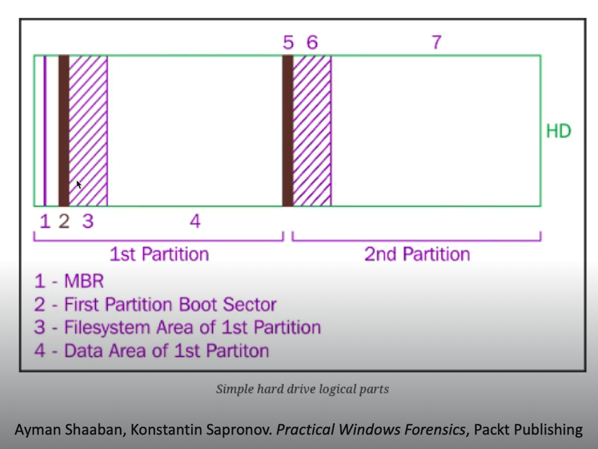

# Practical Windows Forensics Notes

### Forensic Process Overall & Collection
Full NIST 800-86 guide [here](https://nvlpubs.nist.gov/nistpubs/legacy/sp/nistspecialpublication800-86.pdf)

Collection -> Examination -> Analysis -> Reporting -> back to collection (Media -> Data -> Information -> Evidence)

### List of artifacts to collect and examine

Disk Analysis Process: 
- System & Usesr Info
   - Registry
- File Analysis
   - NTFS
- Evidence of Execution
   - Background Activity Moderator
   - ShimCache
   - Amcache
   - Prefetch
- Persistence Mechanisms
   - Run Keys
   - Startup Folder
   - Scheduled Tasks
   - Services
- Event Log Analysis


### Registry Analysis

- HKLM and HKU are really the real ref to the actual hives, others are a combination of references to what is inside these 2 hives
- ~94% of the keys are made of REG_BINARY (arbitrary-lenth bin data) & REG_DWORD (32-bit number) data type
- SOFTWARE hive stores all related keys of the software that installed on the OS
- There are multiple controlSets and to figure out which is our current control set, we go to the Select key and check LastKnownGood
- HKEY_CLASSES_ROOT holds all the user preferences and system specify settings
- LastKnownGood is not updated immediately after boot.It only updates after you log in successfully (i.e., once services have started and the system deems the boot successful).Before login, current control set can be at 001 but lasknowngood is still at 002, and when i log in. Thats when it updates to 001.

- To time save, we can bulk parse from regRipper, check if some dats are hidden, use `attrib *` in cmd to see them, use `attrib -h NTUSER.DAT` to unhide.
- Then in cmd `for /r %i in (*) do ($PATH\rip.exe -r %i -a > %i.txt)` 


# 🗂️ Windows Registry Hive Mapping

This table maps the logical registry hives seen in Windows Registry Editor to their corresponding physical files on disk. It's especially useful in forensics, incident response, or deep system analysis.

## 📘 Main Logical Registry Hives with Physical File Locations

| Hive Root                     | Physical Hive File Location(s)                                                                 | Description                                                  |
|------------------------------|------------------------------------------------------------------------------------------------|--------------------------------------------------------------|
| `HKEY_LOCAL_MACHINE` (HKLM)  | `C:\Windows\System32\config\SAM` <br> `C:\Windows\System32\config\SYSTEM` <br> `C:\Windows\System32\config\SOFTWARE` <br> `C:\Windows\System32\config\SECURITY` <br> `C:\Windows\System32\config\DEFAULT` | System-wide settings loaded from system hive files          |
| `HKEY_CURRENT_USER` (HKCU)   | `C:\Users\<Username>\NTUSER.DAT` <br> `C:\Users\<Username>\AppData\Local\Microsoft\Windows\UsrClass.dat`| Settings for the currently logged-in user                   |
| `HKEY_CLASSES_ROOT` (HKCR)   | Merged view of: <br> - `HKLM\Software\Classes` from `SOFTWARE` hive (`C:\Windows\System32\config\SOFTWARE`) <br> - `HKCU\Software\Classes` from `NTUSER.DAT` & `UsrClass.dat` (`C:\Users\<Username>\NTUSER.DAT`) | File associations, COM registrations, merged from HKCU and HKLM |
| `HKEY_USERS` (HKU)           | `C:\Windows\System32\config\DEFAULT` <br> `C:\Users\<Username>\NTUSER.DAT` (per user profile)  <br> `C:\Users\<Username>\AppData\Local\Microsoft\Windows\UsrClass.dat` (for all user profiles)    | Settings for all user accounts                              |
| `HKEY_CURRENT_CONFIG` (HKCC) | Built dynamically from `HKLM\SYSTEM\CurrentControlSet\Hardware Profiles\Current` (in `SYSTEM` hive) | Hardware profile currently in use, built at boot time       |

## 🔁 Logical to Physical Hive Mapping


| Logical Hive Path                          | Physical Hive File Location                                                  | Notes                                                    |
|--------------------------------------------|-------------------------------------------------------------------------------|----------------------------------------------------------|
| `HKLM\SAM`                                 | `C:\Windows\System32\config\SAM`                                             | SAM database (local user accounts)                      |
| `HKLM\SYSTEM`                              | `C:\Windows\System32\config\SYSTEM`                                          | Core system configuration                                |
| `HKLM\SOFTWARE`                            | `C:\Windows\System32\config\SOFTWARE`                                        | System-wide installed apps and settings                 |
| `HKLM\SECURITY`                            | `C:\Windows\System32\config\SECURITY`                                        | Local security policy, secrets                          |
| `HKLM\HARDWARE`                            | *Volatile - built at boot, not stored on disk*                               | Live hardware info only                                  |
| `HKLM\DEFAULT`                             | `C:\Windows\System32\config\DEFAULT`                                         | Default user profile (used for new user creation)        |
| `HKU\S-1-5-XX-...-1001`                    | `C:\Users\Username\NTUSER.DAT`                                               | Logged-in user's profile                                |
| `HKU\S-1-5-XX-...-1001\Software\Classes`   | `C:\Users\Username\AppData\Local\Microsoft\Windows\UsrClass.dat`            | Per-user class registrations                            |
| `HKCU`                                     | Alias to the SID key in `HKU`, so `NTUSER.DAT` usually `S-1-5-21-...-1001`  | The current user                                        |
| `HKCR`                                     | Merged view of `HKCU\Software\Classes` under `C:\Windows\System32\config\SOFTWARE` and `HKLM\Software\Classes` under `C:\Users\<username>\NTUSER.DAT` | File associations and COM class registrations           |
| `HKCC`                                     | Built from `HKLM\SYSTEM\CurrentControlSet\Hardware Profiles\Current`        | Hardware profile in use                                 |

## 🧠 Notes

- `NTUSER.DAT` and `UsrClass.dat` contain per-user settings and are located in the user’s profile directory.
- `HKCC` and `HKCR` do **not** have their own hive files; they are built dynamically.
- `HKEY_USERS` is useful when multiple users are logged in or loaded manually during forensic analysis.
- `HKEY_CURRENT_USER` is just a pointer to the current SID under `HKEY_USERS`.

---

### Users, Groups and User Profiles
When comes to username and account management, it’s good to use Reg Exp to and go to SAM, Aliases. To export a folder, we press export and it will export as xlsx file, and use timeline explorer to read it. Windows only generate profiles for interactive login, basically interactively with GUI, can use profileList plug in from regripper.

### User Behaviour

A lot of this will depends on how you interact with the system, so if we are following a tutorial, it differs unless we follow the exact steps and movements.

UserAssist: 		Applications opened and is specific to each user, so need to look into each one
RecentDocs: 		Files and folders recently opened
Shellbags:		Locations browsed by the user
Open / Save MRU:	Files that were opened
Last-Visited MRU: 	Applications used to open files

UserAssist:
NTUSER\Software\Microsoft\Windows\CurrentVersion\Explorer\UserAssist
In RegRipper there is a UserAssist plugin, so in the txt doc, we search for UserAssist, then we will see the logs of each user ID, diff key logs diff stuff:

{CEBFF5CD-ACE2-4F4F-9178-9926F41749EA} – a list of app, files, links, and other objects that have been accessed. 

{F4E57C4B-2036-45F0-A9AB-443BCFE33D9F} – Lists the shortcut links used to start programs. The crono order if earlist at bottom and latest to the top.

RecentDocs (store something interacted recently with user):
NTUSER.DAT\Software\Microsoft\Windows\CurrentVersion\Exploere\RecenDocs\

ShellBags:
To do with windows explorers and windows, they can be under: 

NTUSER.DAT:
- HKCU\Software\Microsoft\Windows\Shell\BagMRU
- HKCU\Software\Microsoft\Windows\Shell\Bags

USRCLASS.DAT:
- Local Settings\Software\Microsoft\Windows\Shell\BagMRU
- Software\Classes\Local Settings\Software\Microsoft\Windows\Shell\Bags

There is a shellbags plugin in Regripper, so just go to the session in txt, also, use shellbag explorer for easy win, can even see usb or hard drive connected to system

### NTFS Disk Overview

Logical Overview of a hard drive partition


To see MBR, it is at the unpatitioned Space in FTK, as an analysis the important files are at root\$MFT, patition 2 stores the windows system. The MFT contains records and flats indicating a file is being used or not, if a file is to delete, it just flag the file as deleted, but it can still be on disk. $STD_INFO holds timestamp, $FILE_NAME holds the name and time stamps, but the time stamp is not usually used, thus, the chances for it to be spoof is low, thus rather trustable. $DATA might store the pointer to the actually file, and at last is the slack space which we might find interesting things.

We use MFTECmd from EZ to parse MFT to csv, we can also use it to read into the mft, using –de. An entry/record number is unique, but the first couple is always the same such as $Mft is always 0 because it stores the file itself first and $MftMirr is always 1 in record. To see it the syntax is `MFTECmd.exe -f “<$PATH\SomeMFT” –de 0`

Flags: InUse means the file is not deleted , not in use means deleted

The attributes (STANDARDINFO, FILE NAME etc) 

TIP: FN is where the time when the file start to exist. The Windows API can only modify SI, so if SI and FN have a big difference, then SI might be modified. 

Resident: True means the file is stored some where else on disk

Record Modified On means the mft record is being modified

In Data attribute’s resident value being false, it means whatever content that was supposed to store in the DATA attrib is not there anymore, and the current data is storing a DataRun which is a pointer that points to a cluster and that is that cluster is where we can find the data to the rest of the MFT(might also be the actual file itself), it can be 1 or more dataRuns in the MFT we trying to read.

**MAC(b) notation**

| Attribute         | Flags | Description                                     |
|------------------|:-----:|-------------------------------------------------|
| Modified          | M...  | `<TimeStamp>` — Last modification of file data |
| Accessed          | .A..  | `<TimeStamp>` — Last time file was opened      |
| Changed ($MFT)    | ..C.  | `<TimeStamp>` — Change of the MFT NOT THE CONTENT ITSELF  |
| Birth (Creation)  | ...B  | `<TimeStamp>` — File creation time             |

Extra Resources on MACb: https://andreafortuna.org/2017/10/06/macb-times-in-windows-forensic-analysis/

**Evidence of deleted files**
- USN Journaling are used in an event of system crashing, so important files can be restored.
- Important files for journalling: root/$LogFile, root/$Extend/$UsnJrnl
- The UsnJrnl consist of 2 ADS ($Max, and $J)
- To parse $J we say `mftecmd.exe -f "$PATH\$J" -m "$PATH\$MFT" --csv "Output Path" 

### Execution Artifacts

**Background Activity Moderator (BAM)**
Registry: HKLM\SYSTEM\CurrentControlSet\Services\bam\UserSettings
Extra Resources on BAM: https://dfir.ru/2020/04/08/bam-internals/

**Application Compatibility Cache ("AppCompatCache") / Shimcache**

Registry: SYSTEM\CurrentControlSet\Control\Session Manager\AppCompatCache

It can prove the existence of a malicious executable, it is used for compatibility function for older version softwares
*It only gets updated when the system shutdown, if the system did not shutdown, then it wont be renew*

In reg explorer, when we are reading this key, the Cache Entry Position is the order of the program executed (in general), the Modified Time stamp is not reliable here, use Cache entry position instead.
AppCompatCache is located under SYSTEM and have plugin in regRipper
EZtool also have AppCompatCacheParser `AppCompatCacheParser.exe -f <$Full path of SYSTEM HIVE> --csv <output PATH>

Usually in the csv the Executed flag shows if it was being executed, no means the user might browsed it with IE but didn’t execute it.

UnassociatedFileEntries is a good part to parse, it holds the hash of the exe as well so we can check on VT.

**AmCache**
Most famous HIVE: it is a .hve so technically it is a registry itself not a hive. It stores installer, and executables, we can just drop the .hve file into the reg explorer.
The AmcacheParser is designed to parse the .hve file to csv for easier reading. This parser have a -w and -b for white and black listing so we can filter out some stuff.

Registry: C:\Windows\AppCompat\Programs\Amcache.hve

Below is a resource on how schedule task can affect what we see in Amcache
Extra resources: https://dfir.ru/2018/12/02/the-cit-database-and-the-syscache-hive/


**Prefetch**

The hash at the end of the pf file is a hash of the location being executed. There is a key in SYSTEM HIVE to show if prefetch is enabled for system.
PECmd is the tool to use
Prefetch created on date is the moment when the exec were ran, and modified meanings it might be ran second or third time, a prefetch is created when the exe is ran.

Path on disk: C:\Windows\Prefetch\*.pf


**Shortcut (LNK) Files**
Path: C:\users\<username>\AppData\Roaming\Microsoft\Windows\Recent
Path: C:\users\<username>\AppData\Roaming\Microsoft\Office\Recent

### Persistence Mechanisms

Auto-Run Keys are located in the NTUser.dat & Software.dat Hive

Registry: 
HKEY_CURRENT_USER\Software\Microsoft\Windows\CurrentVersion\Run
HKEY_CURRENT_USER\Software\Microsoft\Windows\CurrentVersion\RunOnce
HKEY_LOCAL_MACHINE\Software\Microsoft\Windows\CurrentVersion\Run
HKEY_LOCAL_MACHINE\Software\Microsoft\Windows\CurrentVersion\RunOnce

Startup Folder
Bin put in this place will auto executed, things to consider is that in the MFT we can search the grep any files related to the startup path `grep StartUp MFT.csv`

Paths:
C:\Users\[Username]\AppData\Roaming\Microsoft\Windows\Start Menu\Programs\Startup
C:\ProgramData\Microsoft\Windows\Start Menu\Programs\StartUp

**Windows Services**
Under SYSTEM HIVE: we can look at reg explorer bookmark, and there is a list under Services. Also has a services plugin for regripper, another plugin call svc v.
Registry: HKLM\SYSTEM\CurrentControlSet\Services

**Scheduled Task**
Located in teh SOFTWARE HIVE:
- HKLM\Software\Microsoft\Windows NT\CurrentVersion\Schedule\TaskCache\Tasks
- HKLM\Software\Microsoft\Windows NT\CurrentVersion\Schedule\TaskCache\Tree

The Taskcache plugin in regripper doesn’t contain subkey structure for Tree and tasks plugin in regripper also do the work, the tree key is relate to the structure in the following Path: C:\Windows\System32\Tasks

**Can also use AutoRun in sys internals to check the disk**

### Event log Analysis

Tools required: 
- [Event Log Explorer](https://eventlogxp.com/) (To view event logs)
- EvtxECmd-EZTools (Parse Event logs to csv files) and view with Timeline Explorer or Excel

**Notes**
- log location: c:\Windows\System32\winevt\logs
- Event log cheat sheet: [ultimatewindowssecurity](https://www.ultimatewindowssecurity.com/securitylog/encyclopedia/default.aspx?i=j), [https://github.com/stuhli/awesome-event-ids?tab=readme-ov-file#event-id-documentation](https://github.com/stuhli/awesome-event-ids?tab=readme-ov-file#event-id-documentation)
- Important logs: security, system, sysmon
- New services event 7045 (malicious activities usually need to start new services)
- logon that is around the malicious activity time
- Tip: After finding the user associated with the malicious activity, search by the Logon ID of the user and creat a local timeline

---
**Key Event IDs to look at**
| Source                            | Event ID(s)         | Description                              |
|-----------------------------------|---------------------|------------------------------------------|
| Microsoft-Windows-Windows Defender | 5000                | Defender enabled                         |
|                                   | 5001                | Defender disabled                        |
| System                            | 7045                | A new service was installed              |
| Security                          | 4624                | An account was successfully logged on    |
| Windows PowerShell                | 400                 | Engine state changed from None to Available |
| Windows PowerShell operational    | 4103                | Executing pipeline (Operational log)     |
| Windows PowerShell operational    | 4104                | Execute a remote command (Operational log) |
| Microsoft-Windows-Sysmon          | 1                   | Process creation                         |
|                                   | 3                   | Network connection                       |
|                                   | 11                  | File created                             |
|                                   | 12, 13              | Registry events                          |
|                                   | 22                  | DNS query                                |

---
Interview question: There are different types of logons, what number is logon type/title etc:
0 System, 2 Interactive, 3 Network(non interactive), 5 service, 10 RemoteInteractive (RDP etc)

If everything is the same in the log, like same user, same name, but different Logon ID, it means there is 2 priv, so 2 logon ID is generated for the same user, not 2 diff user.

In Event log explorer, security logs, we can search by the user.

Power shell specific events: 400(PS log, not operational),403
**🔍 Key Differences Between Windows PowerShell and PowerShell Operational Logs**

| Aspect                | Windows PowerShell Log               | PowerShell Operational Log                        |
|-----------------------|--------------------------------------|---------------------------------------------------|
| **Purpose**           | General PowerShell engine events     | Detailed execution-level monitoring               |
| **Logging Level**     | Basic                                | Advanced (must be enabled via Group Policy)       |
| **Common Event IDs**  | 400 (engine start), 600 (stop)       | 4103 (pipeline exec), 4104 (script block logging) |
| **Usage**             | Tracks when PowerShell starts/stops  | Tracks **what** commands or scripts were run      |
| **Forensics Value**   | Low to moderate                      | **High** — reveals command content and actions    |

Also, rmb to check the powershell version, things can vary. 600 are usually redundant. There are 2 powershell logs, one powershell and one powershell operational. For 400, we can also see the full command executed

Extra resources for event logs:

- https://www.ultimatewindowssecurity.com/securitylog/encyclopedia/default.aspx?i=j
- https://kb.eventtracker.com/
- https://github.com/stuhli/awesome-event-ids


### Memory Analysis with Volitility
Just go read the book: The art of memory forensics

Plugins to run: windows.info, pslist (can be manipulate by attacker), psScan (cannot be manipulate by attacker), PsTree 

Methodology: we try to find sus process by `vol.py -f "Windows 10 x64-Snapshot1.vmem" windows.psscan > psscan.txt`, after identifying their pid,
we dig a bit deeper on each of them by checking their tree relationship `vol.py -f "Windows 10 x64-Snapshot1.vmem" windows.pstree --pid <sus pid>`.
We can then dump the process binary by saying `vol.py -f "Windows 10 x64-Snapshot1.vmem" windows.psscan --pid <sus pid> --dump`. We can also list
all the related dlls related to that process by saying `vol.py -f "Windows 10 x64-Snapshot1.vmem" windows.dlllist --pid <sus pid>` and dump all the 
dll files saying `vol.py -f "Windows 10 x64-Snapshot1.vmem" windows.dlllist --pid <sus pid> --dump`

After all that we can run strings to check all the strings and hash all the sus dll and binaries and check on VT.

We can also say `vol.py -f "Windows 10 x64-Snapshot1.vmem" windows.getsids --pid <sus pid>` to see who owns/runs the process

Little automation script to get all txt files from sus processes
```sh
#!/bin/bash

# Check arguments
if [ "$#" -lt 2 ]; then
  echo "Usage: $0 <memory_file> <pid1> [pid2 pid3 ...]"
  exit 1
fi

MEMFILE="$1"
shift
PIDS=("$@")

DUMPDIR="./vol_output"
mkdir -p "$DUMPDIR"

for PID in "${PIDS[@]}"; do
  echo "Analyzing PID $PID..."

  # Run pstree
  echo "[*] Running pstree for PID $PID"
  vol.py -f "$MEMFILE" windows.pstree --pid "$PID" > "$DUMPDIR/pstree_$PID.txt"

  # Run pslist
  echo "[*] Running pslist for PID $PID"
  vol.py -f "$MEMFILE" windows.pslist --pid "$PID" > "$DUMPDIR/pslist_$PID.txt"

  # Run dlllist
  echo "[*] Running dlllist for PID $PID"
  vol.py -f "$MEMFILE" windows.dlllist --pid "$PID" > "$DUMPDIR/dlllist_$PID.txt"

done

# Run getsid for all PIDs at once
echo "[*] Running getsid for all selected PIDs..."
vol.py -f "$MEMFILE" windows.getsid --pid "${PIDS[@]}" > "$DUMPDIR/getsid_all.txt"

echo "Done. Output saved in $DUMPDIR/"
```

Volatility is also good for checking registry because it is the latest and greatest, and the files associate with the dirty hives are the actions in memory, which
is to be updated. we can say `vol.py -f <mem> windows.registry.printkey -h` to see what we need to do, first will do `vol.py -f <mem> windows.registry.hivelist` 
to see all hives in memory and we can see their relative offset, and knowing the offset, we can say `vol.py -f <mem> windows.registry.printkey --offset <offset> --key <keyname>

### Super Timeline 

🧠 Super Timeline Creation Workflow (Plaso + Volatility)

This workflow combines disk and memory evidence to create a comprehensive super timeline. Below are the steps, tools, and commands used to achieve this.

---

## 📦 Evidence Involved
- `disk.E01` – Disk image
- `memory.raw` – Memory dump

---

## 🛠 Tools Required
- `log2timeline.py` – Extracts timeline data from disk
- `QEMU` - To create a raw disk image, because log2timeline only supports raw
- `volatility` – Extracts memory artifacts (bodyfile format)
- `psort.py` – Parses Plaso storage into a readable CSV timeline
- `plaso-storage-tool` (optional) – To merge multiple Plaso stores

---

## 🔄 Step-by-Step Workflow
1. use vol to generate bodyfile
2. parse disk with log2timeline to gen a plaso file
3. merge bodyfile and plaso file to 1 file
4. and generate a super timeline with psort from plaso tools 


### Additional Resources
- https://cloud.google.com/blog/topics/threat-intelligence/digging-up-the-past-windows-registry-forensics-revisited/
- https://github.com/msuhanov/regf/blob/master/Windows%20registry%20file%20format%20specification.md


Workflow: Got raw disk and mem -> make copy with FTK in E01 -> check hash -> dump registry with ftk, dump reg with KAPE, or load the whole thing and do it in autopsy -> parse it with EZ tools, parse it with regripper -> analysis with Reg explorer, analysis with notepad++ if it's regripper

