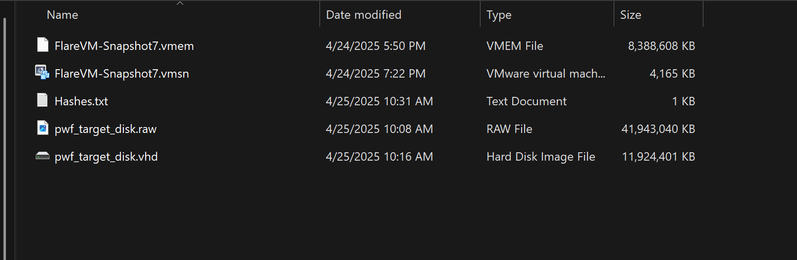

# Practical Windows Forensics project and write up

Project Brief: This project is to set up a win 10 virtual machine as a target, attack it using the attomic red team attack script. Simulate that we are a Forensic Analyst just arriving to the site 
and proceed with a full Windows Forensics project as we would on field. Finishing with a Forensic report at the end.

Tools used:
- EZTools
- Volitility
- KAPE
- Autopsy
- Arsenal Image Mounter

### Forensic Process Overall & Collection
Full NIST 800-86 guide [here](https://nvlpubs.nist.gov/nistpubs/legacy/sp/nistspecialpublication800-86.pdf)

Collection -> Examination -> Analysis -> Reporting -> back to collection (Media -> Data -> Information -> Evidence)

**Order of collection should always follow the order of volitility**
**Step 1**: In real life we will either take a live Data from the machine or put the machine into hibernation so we can collect the data from the memory through hiber.sys file on windows.
In the VM now, we will suspend the VM first. Since I am using VMware, I will preserve the .vmem and the .vmsn and hash it. Next we will collect the disk by using qemu-img by running `qemu-img.exe convert -O vpc <full path that contains vmdk> output_image.vhd`. Hashes will be generated after all this. In real life, all this should be done with FTK Imager instead. 

### First Examination of the Disk

Disk Analysis Process: 
- System & Usesr Info
   - Registry
- File Analysis
   - NTFS
- Evidence of Execution
   - Background Activity Moderator
   - ShimCache
   - Amcache
   - Prefetch
- Persistence Mechanisms
   - Run Keys
   - Startup Folder
   - Scheduled Tasks
   - Services
- Event Log Analysis

### Registry Analysis

With the registry, here are a list of informations that an analyst would like to find out:

- HKLM and HKU are really the real ref to the actual hives, others are a combination of references to what is inside these 2 hives
- ~94% of the keys are made of REG_BINARY (arbitrary-lenth bin data) & REG_DWORD (32-bit number) data type
- SOFTWARE hive stores all related keys of the software that installed on the OS
- There are multiple controlSets and to figure out which is our current control set, we go to the Select key and check LastKnownGood
- HKEY_CLASSES_ROOT holds all the user preferences and system specify settings
- LastKnownGood is not updated immediately after boot.It only updates after you log in successfully (i.e., once services have started and the system deems the boot successful).Before login, current control set can be at 001 but lasknowngood is still at 002, and when i log in. Thats when it updates to 001.

- To time save, we can bulk parse from regRipper, check if some dats are hidden, use `attrib *` in cmd to see them, use `attrib -h NTUSER.DAT` to unhide.
- Then `for /r %i in (*) do ($PATH\rip.exe -r %i -a > %i.txt)` 

# 🗂️ Windows Registry Hive Mapping

This table maps the logical registry hives seen in Windows Registry Editor to their corresponding physical files on disk. It's especially useful in forensics, incident response, or deep system analysis.

## 📘 Main Logical Registry Hives with Physical File Locations

| Hive Root                     | Physical Hive File Location(s)                                                                 | Description                                                  |
|------------------------------|------------------------------------------------------------------------------------------------|--------------------------------------------------------------|
| `HKEY_LOCAL_MACHINE` (HKLM)  | `C:\Windows\System32\config\SAM`   `C:\Windows\System32\config\SYSTEM`   `C:\Windows\System32\config\SOFTWARE`   `C:\Windows\System32\config\SECURITY`   `C:\Windows\System32\config\DEFAULT` | System-wide settings loaded from system hive files          |
| `HKEY_CURRENT_USER` (HKCU)   | `C:\Users\<Username>\NTUSER.DAT`   `C:\Users\<Username>\AppData\Local\Microsoft\Windows\UsrClass.dat`| Settings for the currently logged-in user                   |
| `HKEY_CLASSES_ROOT` (HKCR)   | Merged view of:   - `HKLM\Software\Classes` from `SOFTWARE` hive (`C:\Windows\System32\config\SOFTWARE`)   - `HKCU\Software\Classes` from `NTUSER.DAT` & `UsrClass.dat` (`C:\Users\<Username>\NTUSER.DAT`) | File associations, COM registrations, merged from HKCU and HKLM |
| `HKEY_USERS` (HKU)           | `C:\Windows\System32\config\DEFAULT`   `C:\Users\<Username>\NTUSER.DAT` (per user profile)    `C:\Users\<Username>\AppData\Local\Microsoft\Windows\UsrClass.dat` (for all user profiles)    | Settings for all user accounts                              |
| `HKEY_CURRENT_CONFIG` (HKCC) | Built dynamically from `HKLM\SYSTEM\CurrentControlSet\Hardware Profiles\Current` (in `SYSTEM` hive) | Hardware profile currently in use, built at boot time       |

## 🔁 Logical to Physical Hive Mapping

| Logical Hive Path                          | Physical Hive File Location                                                  | Notes                                                    |
|--------------------------------------------|-------------------------------------------------------------------------------|----------------------------------------------------------|
| `HKLM\SAM`                                 | `C:\Windows\System32\config\SAM`                                             | SAM database (local user accounts)                      |
| `HKLM\SYSTEM`                              | `C:\Windows\System32\config\SYSTEM`                                          | Core system configuration                                |
| `HKLM\SOFTWARE`                            | `C:\Windows\System32\config\SOFTWARE`                                        | System-wide installed apps and settings                 |
| `HKLM\SECURITY`                            | `C:\Windows\System32\config\SECURITY`                                        | Local security policy, secrets                          |
| `HKLM\HARDWARE`                            | *Volatile - built at boot, not stored on disk*                               | Live hardware info only                                  |
| `HKLM\DEFAULT`                             | `C:\Windows\System32\config\DEFAULT`                                         | Default user profile (used for new user creation)        |
| `HKU\S-1-5-XX-...-1001`                    | `C:\Users\Username\NTUSER.DAT`                                               | Logged-in user's profile                                |
| `HKU\S-1-5-XX-...-1001\Software\Classes`   | `C:\Users\Username\AppData\Local\Microsoft\Windows\UsrClass.dat`            | Per-user class registrations                            |
| `HKCU`                                     | Alias to the SID key in `HKU`, so `NTUSER.DAT` usually `S-1-5-21-...-1001`  | The current user                                        |
| `HKCR`                                     | Merged view of `HKCU\Software\Classes` under `C:\Windows\System32\config\SOFTWARE` and `HKLM\Software\Classes` under `C:\Users\<username>\NTUSER.DAT` | File associations and COM class registrations           |
| `HKCC`                                     | Built from `HKLM\SYSTEM\CurrentControlSet\Hardware Profiles\Current`        | Hardware profile in use                                 |

## 🧠 Notes

- `NTUSER.DAT` and `UsrClass.dat` contain per-user settings and are located in the user’s profile directory.
- `HKCC` and `HKCR` do **not** have their own hive files; they are built dynamically.
- `HKEY_USERS` is useful when multiple users are logged in or loaded manually during forensic analysis.
- `HKEY_CURRENT_USER` is just a pointer to the current SID under `HKEY_USERS`.

---

Created for forensic and malware analysis reference.

**User Behavior**
UserAssist: 		Applications opened
RecentDocs: 		Files and folders opened
Shellbags:		Locations browsed by the user
Open / Save MRU:	Files that were opened
Last-Visited MRU: 	Applications used to open files

### NTFS Disk Overview

Logical Overview of a hard drive partition

Important files: $MFT,$J

With the registry, here are a list of informations that an analyst would like to find out:

1. Which files are located in My Computer\CLSID_Desktop\PWF-main\PWF-main\AtomicRedTeam?
2. What is the MFT Entry Number for the file "ART-attack.ps1"?
3. What are the MACB timestamps for "ART-attack.ps1"?
4. Was "ART-attack.ps1" timestomped?
5. When was the file "deleteme_T1551.004" created and deleted?
6. What was the Entry number for "deleteme_T1551.004" and does it still exist in the MFT?

### Execution Artifacts

**Background Activity Moderator (BAM)**
Registry: HKLM\SYSTEM\CurrentControlSet\Services\bam\UserSettings
- Which executables (.exe files) did the BAM record for the IEUser (RID 1000) incl. their last execution date and time? 

**Application Compatibility Cache ("AppCompatCache") / Shimcache**

Registry: SYSTEM\CurrentControlSet\Control\Session Manager\AppCompatCache

Determine the cache entry position for: 
-	AtomicService.exe: 
-	mavinject.exe: 

**AmCache**

Registry: C:\Windows\AppCompat\Programs\Amcache.hve
- What SHA-1 hash did Amcache record for AtomicService.exe?

**Prefetch**

Path: C:\Windows\Prefetch\*.pf
Use the Prefetch-Timeline output to produce a timeline of suspicious execution events in the Eric Zimmerman Timeline Explorer:

- POWERSHELL.exe
- cmd.exe
- NET.exe
- REG.exe
- SCHTASKS.exe
- SC.exe
- ATOMICSERVICE.EXE
- MAVINJECT.exe
- NOTEPAD.exe

**Shortcut (LNK) Files**
Path: C:\users\<username>\AppData\Roaming\Microsoft\Windows\Recent
Path: C:\users\<username>\AppData\Roaming\Microsoft\Office\Recent

### Event log Analysis

Tools required: 
- [Event Log Explorer](https://eventlogxp.com/) (To view event logs)
- EvtxECmd-EZTools (Parse Event logs to csv files) and view with Timeline Explorer or Excel

**Notes**
- log location: c:\Windows\System32\winevt\logs
- Event log cheat sheet: [ultimatewindowssecurity](https://www.ultimatewindowssecurity.com/securitylog/encyclopedia/default.aspx?i=j), [https://github.com/stuhli/awesome-event-ids?tab=readme-ov-file#event-id-documentation](https://github.com/stuhli/awesome-event-ids?tab=readme-ov-file#event-id-documentation)
- Important logs: security, system, sysmon
- New services event 7045 (malicious activities usually need to start new services)
- logon that is around the malicious activity time
- Tip: After finding the user associated with the malicious activity, search by the Logon ID of the user and creat a local timeline

---
**Key Event IDs to look at**
- 5000 Defender enabled
- 5001 Defender disabled
- 7045 A new service was installed
- 4624 An account was successfully logged on
- 400 A new PowerShell was initiated @ windows powershell log
- 4104 & 4103 Execute a remote command & executing pipeline @ Windows PowerShell Operational log

**Sysmon logs**
- 1 Process creation
- 3 Network connection
- 11 File create
- 12, 13 Registry Events
- 22 DNS query

---

### Memory Analysis with Volitility

### Super Timeline 

1. Creating the timeline

## Additional Resources
- https://cloud.google.com/blog/topics/threat-intelligence/digging-up-the-past-windows-registry-forensics-revisited/
- https://github.com/msuhanov/regf/blob/master/Windows%20registry%20file%20format%20specification.md

## Tools to use and showcase
- Autopsy
- FTK imager
- dd
- KAPE
- EZ Tools

Workflow: Got raw disk and mem -> make copy with FTK in E01 -> check hash -> dump registry with ftk, dump reg with KAPE, or load the whole thing and do it in autopsy -> parse it with EZ tools, parse it with regripper -> analysis with Reg explorer, analysis with notepad++ if it's regripper

## Analysis

### System Info

