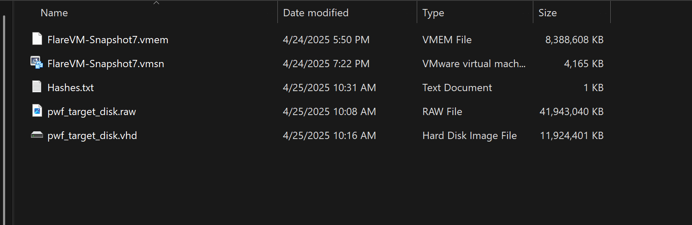

# Practical Windows Forensics project and write up

Project Brief: This project is to set up a win 10 virtual machine as a target, attack it using the attomic red team attack script. Simulate that we are a Forensic Analyst just arriving to the site 
and proceed with a full Windows Forensics project as we would on field. Finishing with a Forensic report at the end.

Tools used:
- EZTools
- Volitility
- KAPE
- Autopsy
- Arsenal Image Mounter

### Forensic Process Overall & Collection
Full NIST 800-86 guide [here](https://nvlpubs.nist.gov/nistpubs/legacy/sp/nistspecialpublication800-86.pdf)

Collection -> Examination -> Analysis -> Reporting -> back to collection (Media -> Data -> Information -> Evidence)

**Order of collection should always follow the order of volitility**
**Step 1**: In real life we will either take a live Data from the machine or put the machine into hibernation so we can collect the data from the memory through hiber.sys file on windows.
In the VM now, we will suspend the VM first. Since I am using VMware, I will preserve the .vmem and the .vmsn and hash it. Next we will collect the disk by using qemu-img by running `qemu-img.exe convert -O vpc <full path that contains vmdk> output_image.vhd`. Hashes will be generated after all this. In real life, all this should be done with FTK Imager instead. 

### First Examination of the Disk
**Rule number 1: Make a copy of the image and mount the drive as read only**

Step1: Open a new case with Autopsy
Step2 (optional): Use KAPE to extract most important artifacts

### Registry Analysis

With the registry, here are a list of informations that an analyst would like to find out:

**System Info**
1. Computername: 
Registry: HKLM\System\CurrentControlSet\Control\Computername\

2. Windows Version: 
Registry: HKLM\Software\Microsoft\Windows NT\Currentversion\

3. Timezone:
Registry: HKLM\System\CurrentControlSet\Control\TimeZoneInformation\

5. Network Information: 
Registry: HKLM\System\CurrentControlSet\Services\Tcpip\Parameters\Interfaces\{interface-name}

6. Shutdown time: 
Registry: HKLM\System\ControlSet001\Control\Windows\ShutdownTime

7. Defender settings:
Registry: HKLM\Software\Microsoft\Windows Defender\

**Users, Groups and User Profiles**
Active accounts during the attack timeframe?
Which account(s) were created?
Which accounts are Administrator group members?
Which users have profiles?

**User Behavior**
UserAssist: 		Applications opened
RecentDocs: 		Files and folders opened
Shellbags:		Locations browsed by the user
Open / Save MRU:	Files that were opened
Last-Visited MRU: 	Applications used to open files

### NTFS Disk Overview

Logical Overview of a hard drive partition

Important files: $MFT,$J

With the registry, here are a list of informations that an analyst would like to find out:

1. Which files are located in My Computer\CLSID_Desktop\PWF-main\PWF-main\AtomicRedTeam?
2. What is the MFT Entry Number for the file "ART-attack.ps1"?
3. What are the MACB timestamps for "ART-attack.ps1"?
4. Was "ART-attack.ps1" timestomped?
5. When was the file "deleteme_T1551.004" created and deleted?
6. What was the Entry number for "deleteme_T1551.004" and does it still exist in the MFT?

### Execution Artifacts

**Background Activity Moderator (BAM)**
Registry: HKLM\SYSTEM\CurrentControlSet\Services\bam\UserSettings
- Which executables (.exe files) did the BAM record for the IEUser (RID 1000) incl. their last execution date and time? 

**Application Compatibility Cache ("AppCompatCache") / Shimcache**

Registry: SYSTEM\CurrentControlSet\Control\Session Manager\AppCompatCache

Determine the cache entry position for: 
-	AtomicService.exe: 
-	mavinject.exe: 

**AmCache**

Registry: C:\Windows\AppCompat\Programs\Amcache.hve
- What SHA-1 hash did Amcache record for AtomicService.exe?

**Prefetch**

Path: C:\Windows\Prefetch\*.pf
Use the Prefetch-Timeline output to produce a timeline of suspicious execution events in the Eric Zimmerman Timeline Explorer:

- POWERSHELL.exe
- cmd.exe
- NET.exe
- REG.exe
- SCHTASKS.exe
- SC.exe
- ATOMICSERVICE.EXE
- MAVINJECT.exe
- NOTEPAD.exe

**Shortcut (LNK) Files**
Path: C:\users\<username>\AppData\Roaming\Microsoft\Windows\Recent
Path: C:\users\<username>\AppData\Roaming\Microsoft\Office\Recent

### Event log Analysis

Tools required: 
- [Event Log Explorer](https://eventlogxp.com/) (To view event logs)
- EvtxECmd-EZTools (Parse Event logs to csv files) and view with Timeline Explorer or Excel

**Notes**
- log location: c:\Windows\System32\winevt\logs
- Event log cheat sheet: [ultimatewindowssecurity](https://www.ultimatewindowssecurity.com/securitylog/encyclopedia/default.aspx?i=j), [https://github.com/stuhli/awesome-event-ids?tab=readme-ov-file#event-id-documentation](https://github.com/stuhli/awesome-event-ids?tab=readme-ov-file#event-id-documentation)
- Important logs: security, system, sysmon
- New services event 7045 (malicious activities usually need to start new services)
- logon that is around the malicious activity time
- Tip: After finding the user associated with the malicious activity, search by the Logon ID of the user and creat a local timeline

---
**Key Event IDs to look at**
- 5000 Defender enabled
- 5001 Defender disabled
- 7045 A new service was installed
- 4624 An account was successfully logged on
- 400 A new PowerShell was initiated @ windows powershell log
- 4104 & 4103 Execute a remote command & executing pipeline @ Windows PowerShell Operational log

**Sysmon logs**
- 1 Process creation
- 3 Network connection
- 11 File create
- 12, 13 Registry Events
- 22 DNS query

---

### Memory Analysis with Volitility

### Super Timeline 

1. Creating the timeline

## Acknowledgements
 All materials used here go to:
 - [https://bluecapesecurity.com/getting-started/](https://bluecapesecurity.com/getting-started/)
