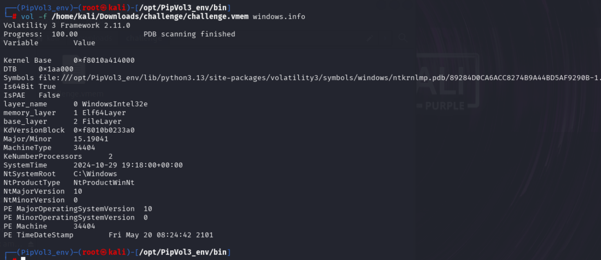
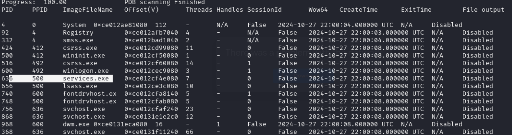
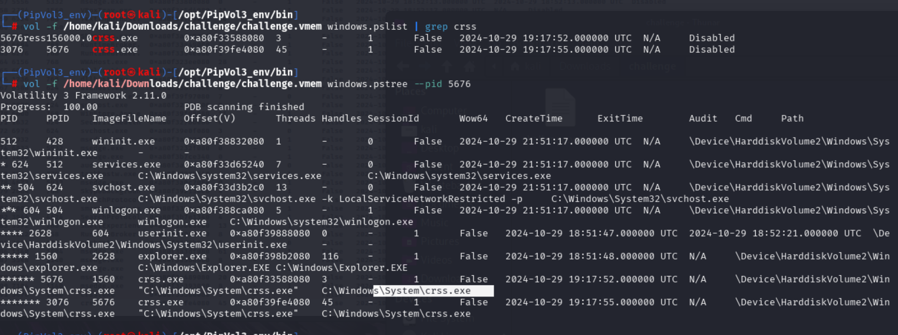

# TCM SOC 101 Challenge 

Scenario: A System Administrator at Earthworm Solutions recently dusted off a memory capture from a Windows workstation that was suspected to have been compromised.
Unfortunately, nobody at the company can remember the details of the incident, and they now require someone to investigate the capture for signs of suspicious activity.
Your task is to test out your memory analysis skills by examining the challenge.vmem file and analyze it for anything out of place or indicative of malware.

1. What was the system time at which the memory dump was captured?
2. What was the major/minor version of the system set to?

Q1 and Q2 can be solved with the command `python3 vol.py <memory file> windows.info`

3. What is the name of the process(es) that appears malicious or out of place?
4. Which legitimate Windows process is it attempting to obfuscate as?

Q3 and Q4 can be solved with `python3 vol.py <memory file> windows.pslist or windows.pstree`, for Q4 the process is trying to pretend csrss.exe 

The real process should be csrss instead of crss

5. How many established network connections did the process have active at the time of capture?

Use `python3 vol.py <memory file> windows.netstat | grep <name of the malicious process>`

6. Using the PID identified in the previous question, what is the name of its parent process?
7. What is the full system path of the malicious process executable?

Use `python3 vol.py <memory file> windows.pstree --pid <ID>` for Q6 and Q7

8. What are the SHA-256 hash values of both malicious process executables?

Dump the file by using `python3 vol.py <memory file> -o <output location> windows.pslist --pid <id> --dump` and hash them

9. What is the name of the persistent run entry set by the malware?
